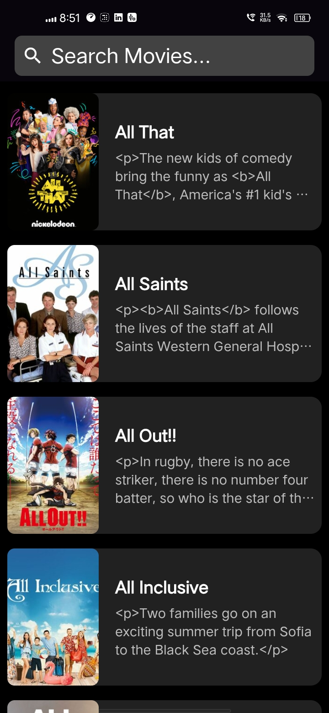
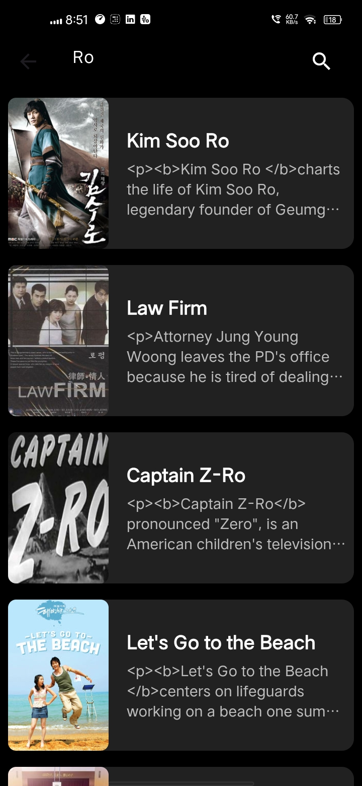
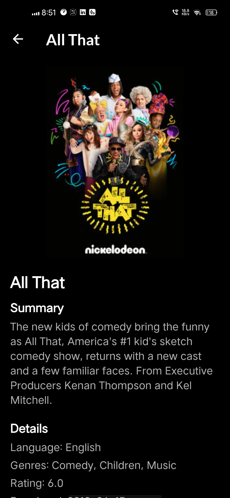
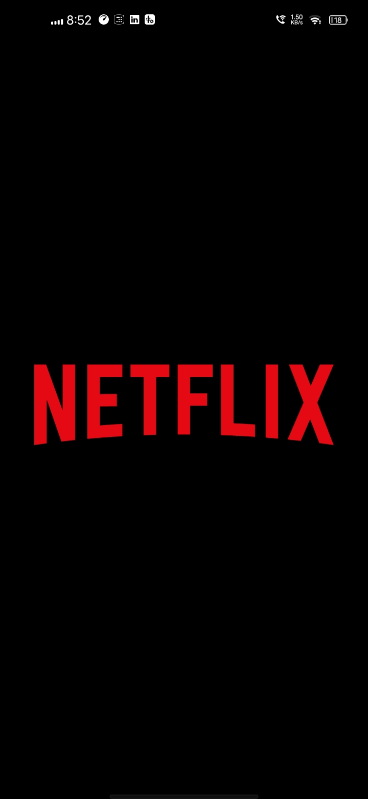

<div align="center">
<h1>🎬 Netflix Clone</h1>
<h3>A Flutter movie browsing app powered by the TVMaze API</h3>
 
**Author: Rohan Mashere**
<br>
<i>B.Tech (Artificial Intelligence & Data Science), Dr. D. Y. Patil Vidypeeth, Pune</i>
 
[](https://flutter.dev)
[](https://www.tvmaze.com/api)
[](https://pub.dev/packages/http)
[](#license)
[](#)
 
**[📲 Download the Android APK](https://drive.google.com/file/d/1XRGiK5sOneeiIZ19pz-houaDhXpQe0Jm/view)**
 
</div>
<h2>📑 Table of Contents</h2>
 
- [About the Project](#-about-the-project)
- [Features](#-features)
- [Tech Stack](#️-tech-stack)
- [Screenshots](#-screenshots)
- [Project Structure](#️-project-structure)
- [Getting Started](#-getting-started)
- [API Reference](#-api-reference)
- [Roadmap](#️-roadmap)
- [Download](#-download)
- [Contributing](#-contributing)
- [License](#-license)
- [Contact](#-contact)
---
 
## 📖 About the Project
 
**Netflix Clone** is a cross-platform Flutter application that recreates the core browsing experience of a streaming service. It fetches live TV show data from the **TVMaze API** and presents it in a sleek, dark, Netflix-inspired interface — complete with a splash screen, a scrollable home feed, real-time search, and a detailed information page for every title.
 
---
 
## ✨ Features
 
- 🚀 **Splash Screen** — Branded launch screen with a timed transition into the app.
- 🏠 **Home Feed** — Fetches and displays a scrollable list of shows from the TVMaze API.
- 🔍 **Live Search** — Search shows by title with a dedicated results screen and loading state.
- 📄 **Details Screen** — Poster, summary (HTML-stripped), language, genres, rating, and premiere date for the selected show.
- 🎨 **Dark, Netflix-Inspired UI** — Consistent black theme with custom typography via Google Fonts.
- ⚠️ **Graceful Error Handling** — Fallback UI for failed image loads, empty results, and API errors.
---
 
## 🛠️ Tech Stack
 
| Layer | Technology |
|---|---|
| Framework | Flutter (Dart) |
| State Management | StatefulWidget + FutureBuilder |
| Networking | http |
| Fonts/UI | google_fonts |
| Data Source | TVMaze REST API |
 
---
 
## 📸 Screenshots
 
<div align="center">
<table>
<tr>
<td align="center"><b>Home Feed</b><br></td>
<td align="center"><b>Search</b><br></td>
<td align="center"><b>Details</b><br></td>
<td align="center"><b>More</b><br></td>
</tr>
</table>
</div>
---
 
## 🗂️ Project Structure
 
```
lib/
├── main.dart            # App entry point
├── splash_screen.dart   # Initial splash/loading screen
├── home_screen.dart     # Home feed with show list
├── search.dart          # Search screen with live results
├── detail.dart          # Show details screen
└── movie.dart           # Movie model & JSON parsing
```
 
---
 
## 🚀 Getting Started
 
### Prerequisites
- [Flutter SDK](https://docs.flutter.dev/get-started/install) installed
- A configured emulator or physical device
### Installation
 
```bash
# Clone the repository
git clone https://github.com/<your-username>/netflix-clone.git
cd netflix-clone
 
# Install dependencies
flutter pub get
 
# Run the app
flutter run
```
 
### Dependencies
 
Add the following to `pubspec.yaml` if not already present:
 
```yaml
dependencies:
  flutter:
    sdk: flutter
  http: ^1.0.0
  google_fonts: ^6.0.0
```
 
> ⚠️ Make sure to add a splash logo image at `assets/netflix-logo.webp` and register it under the `assets` section of `pubspec.yaml`.
 
---
 
## 🌐 API Reference
 
This app uses the free, public [TVMaze API](https://www.tvmaze.com/api):
 
| Endpoint | Description |
|---|---|
| `GET /search/shows?q={query}` | Search shows by name |
 
No API key is required.
 
---
 
## 🗺️ Roadmap
 
- [ ] Add favorites/watchlist functionality
- [ ] Implement local caching for offline support
- [ ] Add pagination/infinite scroll on Home Screen
- [ ] Add cast & episode information on Details Screen
- [ ] Add light/dark theme toggle
---
 
## 📥 Download
 
Grab the latest signed Android APK here:
 
**➡️ [Netflix Clone — APK](https://drive.google.com/file/d/1XRGiK5sOneeiIZ19pz-houaDhXpQe0Jm/view)**
 
---
 
## 🤝 Contributing
 
Contributions, issues, and feature requests are welcome! Feel free to check the [issues page](../../issues) or open a pull request.
 
---
 
## 📄 License
 
This project is licensed under the MIT License — see the [LICENSE](LICENSE) file for details.
 
 
<div align="center">
Made with ❤️ using Flutter
 
</div>